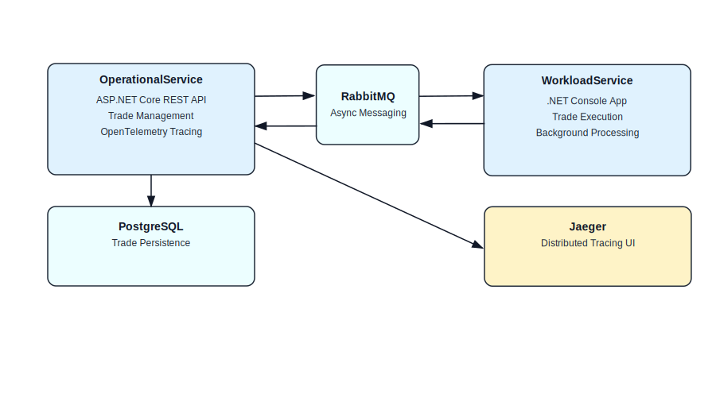
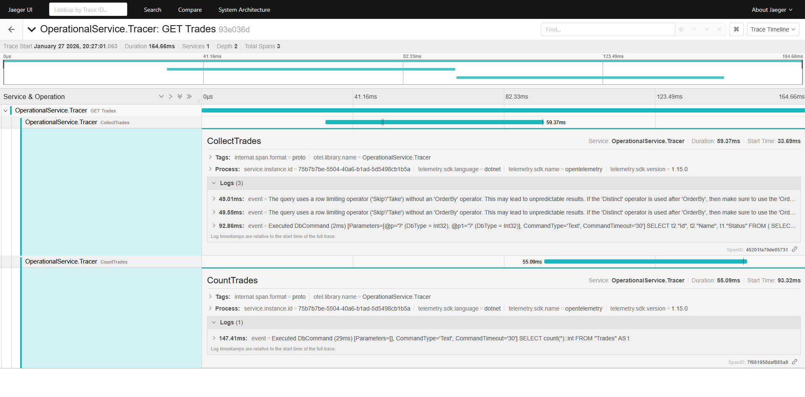

# Francesco Caruana – MeDirect Assessment Test

This repository contains my solution to a technical assessment provided as part of the MeDirect recruitment process.
The goal of this project is to demonstrate my approach to backend service design, containerization, inter-service communication, observability, and database management using modern .NET and cloud-native patterns.

---

## Table of Contents

1. [Project Overview](#project-overview)

   * [Services](#services)
   * [Communication & Observability](#communication--observability)
2. [Architecture Highlights](#architecture-highlights)
3. [Architecture Diagram](#architecture-diagram)
4. [Starting the Services](#starting-the-services)

   * [Prerequisites](#prerequisites)
   * [Step 1: Start the infrastructure and services](#step-1-start-the-infrastructure-and-services)
   * [Step 2: Initialize the database](#step-2-initialize-the-database)
5. [Trace Visualization](#trace-visualization)
6. [API Usage Examples](#api-usage-examples)

   * [Create a New Trade](#create-a-new-trade)
   * [Get All Trades](#get-all-trades)
7. [Swagger UI](#swagger-ui)
8. [Jaeger UI](#jaeger-ui)
9. [Future Improvements & Reflections](#future-improvements--reflections)
10. [Conclusion](#conclusion)

---

## Project Overview

The solution is composed of **two independent services** that work together to manage and execute trades in an asynchronous, event-driven manner.

### Services

#### 1. OperationalService

* A RESTful API built with ASP.NET Core.
* Responsible for managing Trades (creation, persistence, and orchestration).
* Persists trade data in a **PostgreSQL** database using **Entity Framework Core**.
* Publishes messages to **RabbitMQ** to trigger trade execution workflows.
* Fully instrumented with **OpenTelemetry** for distributed tracing.

#### 2. WorkloadService

* A .NET Console application.
* Subscribes to RabbitMQ messages produced by the OperationalService.
* Executes registered Trades asynchronously based on received messages.
* Designed to simulate background or batch-style workloads.

### Communication & Observability

* **RabbitMQ** is used as the messaging backbone to decouple the services and enable asynchronous processing.
* **OpenTelemetry** is used to trace all operations within the OperationalService.
* Traces are exported to **Jaeger**, where they can be visualized through the Jaeger UI for debugging and performance analysis.

---

## Architecture Highlights

* Microservice-style separation of concerns
* Asynchronous, message-driven communication
* Containerized services using Docker and Docker Compose
* Runtime-safe database migrations
* End-to-end observability via distributed tracing

---

## Architecture Diagram



---

## Starting the Services

### Prerequisites

* Docker
* Docker Compose
* .NET SDK (for running EF Core migrations locally)

---

### Step 1: Start the infrastructure and services

From the project root directory, run:

```commandline
docker compose up --build -d
```

This will start:

* PostgreSQL
* RabbitMQ
* OperationalService
* WorkloadService
* Jaeger

---

### Step 2: Initialize the database

The database schema is managed using **Entity Framework Core migrations**.

#### 1. Install EF Core CLI (if not already installed)

```commandline
dotnet tool install --global dotnet-ef
```

#### 2. Apply the latest migration

```commandline
dotnet ef database update --project src/Database/Database.csproj --connection "User ID=user;Password=pass;Host=localhost;Port=5432;Database=db;"
```

This will create and initialize the PostgreSQL schema required by the OperationalService.

---

## Trace Visualization

Once the services are running, you can access the **Jaeger UI** to inspect distributed traces generated by the OperationalService. This allows you to follow request lifecycles, database interactions, and message-publishing operations end-to-end.


## API Usage Examples

The `OperationalService` exposes a REST API for managing Trades. Below are example requests using `curl` that demonstrate how to interact with the service once it is running.

---

### Create a New Trade

This endpoint creates a new Trade and persists it to the database. Once created, the Trade will be published to RabbitMQ for asynchronous processing by the `WorkloadService`.

```bash
curl -X POST http://localhost:5000/trades \
  -H "Content-Type: application/json" \
  -d '{
    "name": "My 1st Trade"
  }'
```

**Example request payload:**

```json
{
  "name": "My 1st Trade"
}
```

---

### Get All Trades

This endpoint retrieves a paginated list of all Trades currently stored in the system.

```bash
curl http://localhost:5000/trades
```

**Example response:**

```json
{
  "data": [
    {
      "id": "d48e6d8c-ca8d-41f5-96f0-90f5610fe757",
      "name": "My 1st Trade",
      "status": "complete"
    }
  ],
  "pagination": {
    "pageNumber": 1,
    "pageSize": 10,
    "totalCount": 1
  }
}
```

---

## Swagger UI

The REST API is documented using Swagger and can be explored interactively via the Swagger UI:

**[http://localhost:5000/swagger/](http://localhost:5000/swagger/)**

The Swagger UI provides a convenient way to inspect available endpoints, request/response models, and to execute requests directly from the browser.


---

## Jaeger UI

All distributed traces emitted by the `OperationalService` are exported using OpenTelemetry and can be visualized using Jaeger:

**[http://localhost:16686/](http://localhost:16686/)**

The Jaeger UI allows you to inspect request lifecycles end-to-end, including database interactions and asynchronous messaging flows between services.



## Future Improvements & Reflections

While this project demonstrates a functional microservice architecture with asynchronous message-driven communication, there are several areas I would have liked to explore further if time allowed:

* **Expanded Test Coverage** – I would have added more unit and integration tests to achieve closer to 100% code coverage, ensuring that edge cases and failure scenarios are fully captured.
* **Native Dependency Injection for RabbitMQ** – Experimenting with native DI patterns for messaging would have improved testability, configurability, and alignment with modern .NET Core practices.
* **Dynamic Worker Management** – In my initial design, the `OperationalService` (master) would expose an endpoint to dynamically create additional `WorkloadService` workers. This approach would have involved:

  * Spawning new containers on-demand via Docker.
  * Tracking container lifecycle events (start/stop/die) through a listener and updating the message queue registration.
    While conceptually appealing for scaling workloads, this added significant architectural complexity and could have made the system flow harder to understand in a limited-time assessment.

### Methodology Reflection

This project follows a **master-worker microservice pattern**, with:

* The **OperationalService** acting as the master, managing trades and publishing messages.
* The **WorkloadService** acting as a worker, asynchronously processing trades based on messages received via RabbitMQ.

A key consideration in this design is that workers must be available and running to consume messages. This influenced my decision to simplify dynamic worker creation, ensuring clarity in the overall architecture while still demonstrating event-driven, asynchronous processing principles.

### Conclusion

Overall, this project was an opportunity to familiarize myself with **modern C#/.NET Core standards**, **containerized microservices**, and **observability practices**, while balancing functionality, maintainability, and reviewer comprehension.
